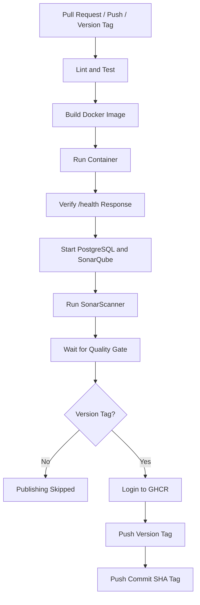

# DevOps CI/CD Health API

[](https://github.com/ahsanjamil583/ci-cd-pipelines/actions/workflows/ci.yml)

A simple Node.js and Express health-check API built to demonstrate a complete DevOps CI/CD workflow using automated testing, ESLint, multi-stage Docker builds, Docker Compose, SonarQube, Trivy, GitHub Actions, and GitHub Container Registry.

## API Endpoint

```http
GET /health
```

Expected response:

```json
{
  "status": "healthy"
}
```

## Project Features

- Node.js and Express health API
- Automated testing with Jest and Supertest
- Code linting with ESLint
- Test coverage with LCOV
- Multi-stage production Docker image
- Non-root container execution
- Docker healthcheck
- Docker Compose stack
- SonarQube code-quality analysis
- PostgreSQL database for SonarQube
- Trivy container vulnerability scanning
- GitHub Actions CI pipeline
- Pull Request and main-branch validation
- Tag-based GHCR image publishing
- Version and commit-SHA image tags

## CI/CD Pipeline



### Trigger Behaviour

| Trigger | Tests and scans | GHCR publishing |
|---|---:|---:|
| Pull Request to `main` | Yes | No |
| Push or merge to `main` | Yes | No |
| Push version tag such as `v1.0.1` | Yes | Yes, after all checks pass |

## Technology Stack

- Node.js 24
- Express
- Jest
- Supertest
- ESLint
- Docker
- Docker Compose
- PostgreSQL
- SonarQube Community Build
- Trivy
- GitHub Actions
- GitHub Container Registry

## Project Structure

```text
.
 .github/
    workflows/
        ci.yml
 docs/
    evidence/
 src/
    app.js
    server.js
 tests/
    health.test.js
 .dockerignore
 .env.example
 .gitignore
 compose.ci.yaml
 docker-compose.yml
 Dockerfile
 eslint.config.js
 jest.config.js
 package.json
 package-lock.json
 sonar-project.properties
 README.md
```

## Prerequisites

Install the following tools before running the project:

- Git
- Node.js 24 or compatible version
- npm
- Docker Engine
- Docker Compose
- curl
- Trivy for local vulnerability scanning

Verify installations:

```bash
git --version
node --version
npm --version
docker --version
docker compose version
curl --version
trivy --version
```

## Local Setup

Clone the repository:

```bash
git clone https://github.com/ahsanjamil583/ci-cd-pipelines.git
cd ci-cd-pipelines
```

Create the local environment file:

```bash
cp .env.example .env
```

Update `.env` and replace the example SonarQube database password with a strong local password:

```env
PORT=3000

SONAR_DB_NAME=sonar
SONAR_DB_USER=sonar
SONAR_DB_PASSWORD=replace-with-a-strong-password
```

Install exact dependency versions:

```bash
npm ci
```

Start the application:

```bash
node src/server.js
```

The application will listen on:

```text
http://localhost:3000
```

Verify the health endpoint from another terminal:

```bash
curl -i http://localhost:3000/health
```

Expected body:

```json
{"status":"healthy"}
```

Stop the application with:

```text
Ctrl + C
```

## Automated Tests

Run Jest and Supertest:

```bash
npm test
```

Run tests sequentially:

```bash
npm test -- --runInBand
```

Run tests with coverage:

```bash
npm run test:coverage
```

The LCOV report is generated at:

```text
coverage/lcov.info
```

## Linting

Run ESLint:

```bash
npm run lint
```

Apply automatically fixable ESLint corrections:

```bash
npx eslint . --fix
```

The command returns a non-zero exit code when linting errors are present, causing the CI pipeline to fail.

## Docker Build

Build the final production image:

```bash
docker build \
  --target production \
  --tag health-api:latest \
  .
```

The multi-stage Dockerfile:

1. Installs all dependencies.
2. Runs ESLint and Jest.
3. Installs production dependencies only.
4. Creates a lightweight final image.
5. Runs the application as the non-root `node` user.
6. Includes an application healthcheck.

## Container Run

Remove any previous container with the same name:

```bash
docker rm -f health-api 2>/dev/null || true
```

Run the container:

```bash
docker run \
  --detach \
  --name health-api \
  --publish 3000:3000 \
  health-api:latest
```

Check status:

```bash
docker ps
```

Verify Docker health status:

```bash
docker inspect \
  --format='Running={{.State.Running}} Health={{.State.Health.Status}}' \
  health-api
```

Verify the endpoint:

```bash
curl http://localhost:3000/health
```

View logs:

```bash
docker logs health-api
```

Remove the container:

```bash
docker rm -f health-api
```

## Docker Compose

The Compose stack contains:

- `app`: Node.js health API
- `sonarqube`: SonarQube server
- `db`: PostgreSQL database used by SonarQube

Validate the Compose configuration:

```bash
docker compose config
```

Start the complete stack:

```bash
docker compose up -d --build
```

Check service status:

```bash
docker compose ps
```

View logs:

```bash
docker compose logs
```

Follow SonarQube logs:

```bash
docker compose logs -f sonarqube
```

Stop containers while preserving named volumes:

```bash
docker compose down
```

Remove containers and persistent volumes:

```bash
docker compose down --volumes
```

> Warning: `docker compose down --volumes` permanently removes the local PostgreSQL and SonarQube data stored in Compose volumes.

## Local SonarQube Analysis

Create `.env` from the supplied example and configure a strong database password:

```bash
cp .env.example .env
```

Configure the Linux host values required by SonarQube:

```bash
sudo sysctl -w vm.max_map_count=524288
sudo sysctl -w fs.file-max=131072
```

Start PostgreSQL and SonarQube:

```bash
docker compose up -d db sonarqube
```

Wait until SonarQube is ready:

```bash
until curl --fail --silent \
  http://localhost:9000/api/system/status |
  grep -q '"status":"UP"'
do
  echo "Waiting for SonarQube..."
  sleep 5
done
```

Open the dashboard:

```text
http://localhost:9000
```

Create an analysis token from the SonarQube user security settings. Do not save the token in the repository.

Configure the scanner session:

```bash
export SONAR_HOST_URL=http://localhost:9000

read -s -p "Enter SONAR_TOKEN: " SONAR_TOKEN
export SONAR_TOKEN
echo
```

Generate test coverage:

```bash
npm run test:coverage
```

Run the scanner:

```bash
npm run sonar
```

The scanner configuration waits for the Quality Gate result. A failed Quality Gate returns a non-zero exit code.

Stop the local SonarQube stack:

```bash
docker compose down
```

## Trivy Vulnerability Scan

Scan the production image for all known vulnerabilities:

```bash
trivy image \
  --scanners vuln \
  health-api:latest
```

Run the required blocking scan:

```bash
trivy image \
  --scanners vuln \
  --severity CRITICAL \
  --exit-code 1 \
  health-api:latest
```

Behaviour:

```text
No CRITICAL vulnerability
 Exit code 0
 Security gate passes

CRITICAL vulnerability found
 Exit code 1
 Security gate fails
```

The blocking command intentionally does not use `--ignore-unfixed`.

The published GHCR image can also be scanned directly:

```bash
trivy image \
  --scanners vuln \
  --severity CRITICAL \
  --exit-code 1 \
  ghcr.io/ahsanjamil583/ci-cd-pipelines:v1.0.1
```

## GitHub Actions

The workflow is located at:

```text
.github/workflows/ci.yml
```

The pipeline contains five jobs:

### 1. Lint and test

- Checks out the repository
- Configures Node.js
- Runs `npm ci`
- Runs ESLint
- Runs Jest with coverage
- Uploads the coverage artifact

### 2. Build and verify container

- Builds the production Docker image
- Starts a temporary container
- Maps runner port `3001` to container port `3000`
- Waits for application readiness
- Calls `GET /health`
- Verifies the exact JSON response
- Collects diagnostics on failure
- Always removes the temporary container

### 3. SonarQube Quality Gate

- Starts temporary PostgreSQL and SonarQube containers
- Waits until SonarQube reports `UP`
- Generates temporary credentials
- Generates Jest coverage
- Runs SonarScanner
- Waits for the Quality Gate
- Uploads SonarQube reports
- Removes the temporary stack

### 4. Trivy Vulnerability Scan

- Rebuilds the final production Docker image
- Scans operating-system and application packages
- Generates a complete Trivy report
- Uploads the report as a GitHub Actions artifact
- Fails the workflow when a CRITICAL vulnerability is detected
- Does not ignore unfixed critical vulnerabilities

### 5. Publish Image to GHCR

This job runs only for semantic version tags such as `v1.0.1`.

Publishing requires all previous jobs to pass:

- Lint and test
- Docker build and health verification
- SonarQube Quality Gate
- Trivy critical vulnerability scan

## GitHub Secrets and Permissions

The current workflow uses an ephemeral SonarQube server.

Therefore:

- `SONAR_DB_PASSWORD` is generated dynamically during the job.
- `SONAR_TOKEN` is generated dynamically by the temporary SonarQube server.
- Sensitive values are masked in GitHub Actions logs.
- No SonarQube token is committed to the repository.

GHCR authentication uses:

```yaml
username: ${{ github.actor }}
password: ${{ secrets.GITHUB_TOKEN }}
```

`GITHUB_TOKEN` is generated automatically by GitHub Actions. It does not need to be manually added under repository secrets.

The publishing job requires:

```yaml
permissions:
  contents: read
  packages: write
```

For a persistent external SonarQube server, configure:

```text
Repository variable:
SONAR_HOST_URL

Repository secret:
SONAR_TOKEN
```

Never hardcode tokens, passwords, or API keys in source code, Compose files, workflow files, or committed `.env` files.

## GHCR Publishing

The published package is:

```text
ghcr.io/ahsanjamil583/ci-cd-pipelines
```

Publishing occurs only after pushing a version tag:

```bash
git switch main
git pull origin main

git tag -a v1.0.1 -m "Release v1.0.1"
git push origin v1.0.1
```

The workflow publishes two references to the same image:

```text
ghcr.io/ahsanjamil583/ci-cd-pipelines:v1.0.1
ghcr.io/ahsanjamil583/ci-cd-pipelines:<full-commit-sha>
```

Pull the versioned image:

```bash
docker pull \
  ghcr.io/ahsanjamil583/ci-cd-pipelines:v1.0.1
```

Run it:

```bash
docker run \
  --detach \
  --name health-api-release \
  --publish 3100:3000 \
  ghcr.io/ahsanjamil583/ci-cd-pipelines:v1.0.1
```

Verify:

```bash
curl http://localhost:3100/health
```

Cleanup:

```bash
docker rm -f health-api-release
```

## Evidence

Submission evidence is stored under:

```text
docs/evidence/
```

Evidence index:

- [Complete evidence index](docs/evidence/README.md)
- [Health endpoint response](docs/evidence/outputs/health-response.txt)
- [Docker healthy status](docs/evidence/outputs/docker-status.txt)
- [SonarQube Quality Gate result](docs/evidence/outputs/quality-gate.json)
- [Trivy critical scan](docs/evidence/outputs/trivy-critical.txt)
- [Git branches](docs/evidence/outputs/git-branches.txt)
- [Git commit history](docs/evidence/outputs/git-history.txt)
- [Git release tags](docs/evidence/outputs/git-tags.txt)

## Troubleshooting

### Docker permission denied

Error:

```text
permission denied while trying to connect to the Docker daemon socket
```

Temporary solution:

```bash
sudo docker ps
```

Permanent user setup:

```bash
sudo usermod -aG docker "$USER"
```

Log out and log back in before testing again.

### Port already allocated

Check the port:

```bash
sudo ss -ltnp | grep ':3000'
docker ps
```

Remove the conflicting container:

```bash
docker rm -f health-api
```

Or use another host port:

```bash
docker run -d \
  --name health-api \
  -p 3100:3000 \
  health-api:latest
```

### `npm ci` fails

Ensure `package-lock.json` exists and matches `package.json`:

```bash
npm install
git status
```

Commit the updated lock file when dependency changes are intentional.

### Tests fail

```bash
npm test -- --runInBand
```

Check the expected status code and JSON response in `tests/health.test.js`.

### SonarQube is not ready

```bash
docker compose ps
docker compose logs --tail 200 sonarqube
docker compose logs --tail 100 db
```

Also verify:

```bash
sysctl vm.max_map_count
sysctl fs.file-max
```

### Trivy exits with code 1

A CRITICAL vulnerability was detected. Review:

```bash
trivy image \
  --scanners vuln \
  --severity CRITICAL \
  health-api:latest
```

Update the affected base image or dependency, rebuild the production image, and scan again.

### GHCR push is denied

Confirm that the publishing job contains:

```yaml
permissions:
  contents: read
  packages: write
```

Also confirm that authentication uses:

```yaml
password: ${{ secrets.GITHUB_TOKEN }}
```

### Publish job is skipped

Publishing is intentionally skipped for:

- Pull Requests
- Normal branch pushes
- Pushes to `main`

It runs only when a version tag such as `v1.0.1` is pushed.

## Security Notes

- `.env` is excluded from Git.
- SonarQube tokens are not committed.
- GHCR uses GitHub's temporary workflow token.
- The final container runs as a non-root user.
- Development dependencies are excluded from the production image.
- The application exposes only its required runtime port.
- Critical Trivy findings block the security gate.

## Author

**Ahsan Jamil**

GitHub: `ahsanjamil583`
